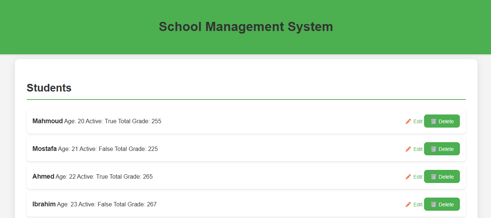
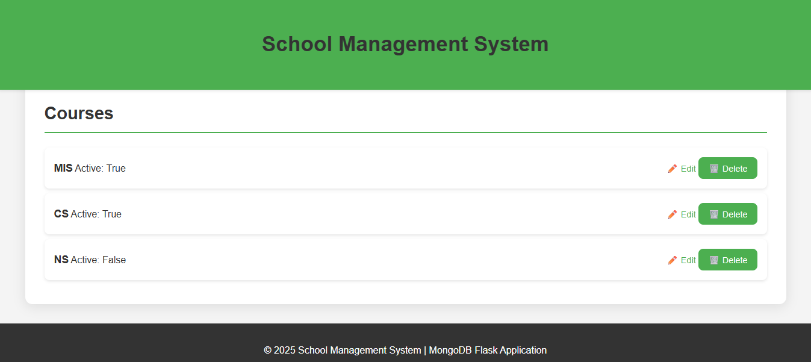

# 🏫 School Management System – MongoDB + Flask
A **web-based school management system** built using **Flask**, **MongoDB**, and **Bootstrap**.  
The system allows you to manage **students** and **courses** with an interactive, user-friendly interface.

---

## 📸 Screenshots
**🏠 Home Page**  
  

**🟩 Students Section** — View, edit, and delete student records  
  

**🟦 Courses Section** — Manage courses and their active status  
  

---

## 📌 Features
- ➕ Add Student & Course  
- ✏️ Edit / Delete Records  
- 🧮 Calculate Grades  
- 🔍 Run Custom Mongo Queries  
- 📁 View Indexes  
- 🗑️ Delete Specific Documents  

---

## 🛠 Tech Stack
- 🐍 Python (Flask Framework)  
- 🍃 MongoDB (NoSQL Database)  
- 🎨 HTML / CSS / Bootstrap  
- 🎯 FontAwesome Icons  

---

## 🚀 How to Run
### 1️⃣ Install dependencies
pip install flask pymongo

### 2️⃣ Start the Flask app
python app.py

### 3️⃣ Open in browser
http://localhost:5000

---

## 📂 Project Structure
Mongo-Task/  
├── app.py  
├── static/  
│   └── style.css  
├── templates/  
│   ├── index.html  
│   └── ...  
└── requirements.txt  

---

## 📌 Notes
- Ensure MongoDB is running locally on port `27017`.  
- The database name used is `school_db`.  

---

## 👤 Author
**Mahmoud Elnahrawy**  
📧 mahmoudelnahrawywork@gmail.com  
📍 Cairo, Egypt  

---

## 🪪 License
MIT License — free to use, modify, and distribute.
